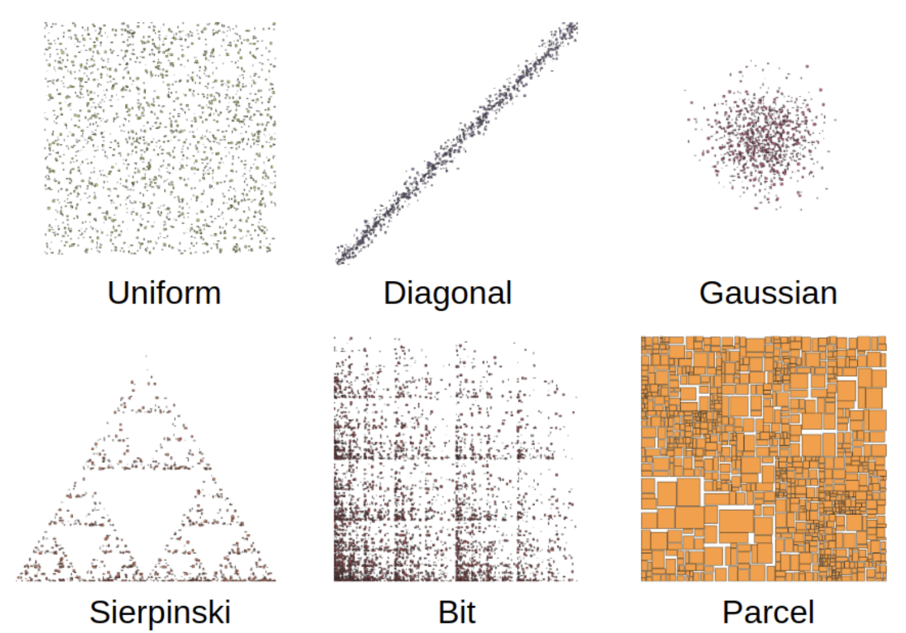

# SpatialBench Spider Data Generator

Spider module is SpatialBench’s built-in spatial geometry generator.
It creates Points, Boxes, and Polygons using deterministic random distributions.

Spider is designed for benchmark reproducibility:
- Generates millions of geometries per second.
- Uses seeds for deterministic output.
- Supports affine transforms to map the unit square [0,1]² into real-world coordinates.

Reference: [SpiderWeb: A Spatial Data Generator on the Web](https://dl.acm.org/doi/10.1145/3397536.3422351) by Katiyar et al., SIGSPATIAL 2020.

## Supported Distribution Types

| Type         | Description                                                   |
|--------------|---------------------------------------------------------------|
| `UNIFORM`    | Uniformly distributed points in `[0,1]²`                      |
| `NORMAL`     | 2D Gaussian distribution with configurable `mu` and `sigma`   |
| `DIAGONAL`   | Points clustered along a diagonal                             |
| `BIT`        | Points in a grid with `2^digits` resolution                   |
| `SIERPINSKI` | Fractal pattern using Sierpinski triangle                     |



## Using Spider in the CLI

```bash
spatialbench-cli -s 1 --tables trip,building --config spatialbench-config.yaml
```

If --config is omitted, SpatialBench will try a local default and then fall back to built-ins (see [Configuration Resolution & Logging](#configuration-resolution--logging)).

## Expected Config File Structure

At the top level, the YAML may define:

```yaml
trip:      # (optional) Config for Trip pickup points
building:  # (optional) Config for Building polygons
```

Each entry must conform to the SpiderConfig schema:

```yaml
<name>:
  dist_type: <string>        # uniform | normal | diagonal | bit | sierpinski | parcel
  geom_type: <string>        # point | box | polygon
  dim: <int>                 # usually 2
  seed: <int>                # random seed for reproducibility
  affine: [f64; 6]           # optional affine transform
  width: <float>             # used if geom_type = box
  height: <float>            # used if geom_type = box
  maxseg: <int>              # polygon max segments
  polysize: <float>          # polygon size or radius
  params:                    # distribution-specific parameters
    type: <string>           # one of: none, normal, diagonal, bit, parcel
    ...                      # fields depend on type (see table below)
```

## Supported Distribution Parameters

| Variant    | Field                  | Description                                                                |
|------------|------------------------|----------------------------------------------------------------------------|
| `None`     | `--`                   | For distributions like Uniform or Sierpinski that don’t require parameters |
| `Normal`   | `mu`, `sigma`          | Controls center and spread for 2D Gaussian                                 |
| `Diagonal` | `percentage`, `buffer` | Mix of diagonal-aligned points and noisy buffer                            |
| `Bit`      | `probability`, `digits` | Recursive binary split with resolution control                             |

## Default Configs

The repository includes a ready-to-use default file:
[`spatialbench-config.yml`](/spatialbench-config.yml).

These defaults are automatically used if no `--config` is passed and the file exists in the current working directory.

## Configuration Resolution & Logging

When SpatialBench starts, it resolves configuration in this order:

1. Explicit config: If --config <path> is provided, that file is used.
2. Local default: If no flag is provided, SpatialBench looks for ./spatialbench-config.yml in the current directory.
3. Built-ins: If neither is found, it uses compiled defaults from spider_defaults.rs.

## Affine Transform

The affine transform maps coordinates from the unit square [0,1]² into real-world ranges.
It is expressed as an array of 6 numbers:

```
[a, b, c, d, e, f]
```

Applied as:

```
X = a*x + b*y + c
Y = d*x + e*y + f
```

- a, e → scale factors in X and Y.
- b, d → shear/skew (usually 0 for simple scaling).
- c, f → translation offsets.

#### How to fill it

1. Decide the bounding box of your target region:
   - Example (continental USA): [-125.24, 24.00, -66.87, 49.18] → west, south, east, north.
2. Compute scale and offset:
   - scale_x = (east - west)
   - scale_y = (north - south)
   - offset_x = west
   - offset_y = south
3. Plug into [a, b, c, d, e, f] with no skew:
   - [scale_x, 0.0, offset_x, 0.0, scale_y, offset_y]

#### Example: Mapping [0,1]² to Continental USA

```yaml
affine: [58.368269, 0.0, -125.244606, 0.0, 25.175375, 24.006328]
```

Which means:
- x=0 → -125.24, x=1 → -66.87
- y=0 → 24.00, y=1 → 49.18